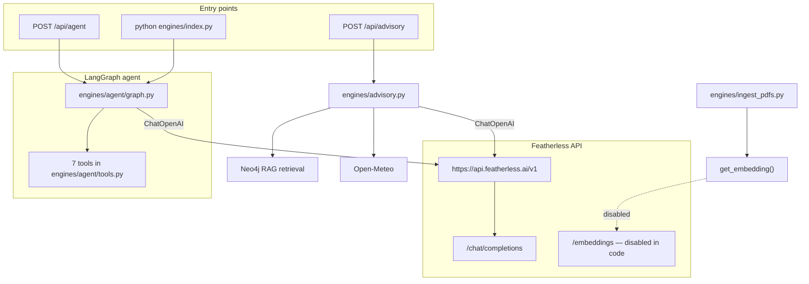

# Featherless Integration in SokoSense

This document explains how **Featherless** (OpenAI-compatible LLM API at `https://api.featherless.ai/v1`) is used in SokoSense. All claims are grounded in the repository as it exists today.

---

## 1. Role in the product

Featherless is the **primary large language model provider** for:

1. **LangGraph agent** — multi-tool agricultural assistant (prices, loans, weather, advisory).
2. **Advisory RAG synthesis** — turns Neo4j graph + vector + weather context into a farmer-facing answer.

Featherless is **not** used for:

- Market/timing/loan **rule engines** (those are deterministic Python logic + KAMIS data).
- Keyword extraction in advisory (regex/list matching in `engines/advisory.py`).
- Weather geocoding or price scraping (separate APIs).

| Use case | Featherless? | File(s) |
|----------|--------------|---------|
| Agent chat + tool routing | Yes | `engines/agent/graph.py` |
| Advisory final answer | Yes | `engines/advisory.py` |
| PDF / query embeddings | Intended, **currently disabled** | `engines/neo4j_client.py` |
| SMS parsing (`sms_parser.py`) | Referenced in project docs only — **file not present in repo** | — |

---

## 2. Architecture overview



---

## 3. Configuration

Environment variables (see `.env.example`):

```env
FEATHERLSS_API_KEY=your_featherless_api_key_here
LLM_MODEL_FEATHERLESS=MiniMaxAI/MiniMax-M3
```

**Note:** The env var is spelled `FEATHERLSS_API_KEY` (double **S**) throughout the codebase — this is intentional in the repo, not a documentation typo.

| Variable | Used by | Purpose |
|----------|---------|---------|
| `FEATHERLSS_API_KEY` | Agent + advisory | Bearer token for Featherless |
| `LLM_MODEL_FEATHERLESS` | Agent + advisory | Model slug on Featherless |

### Default models (code defaults differ by module)

| Module | Default model if env unset |
|--------|----------------------------|
| `engines/agent/graph.py` | `deepseek-ai/DeepSeek-V4-Flash` |
| `engines/advisory.py` | `MiniMaxAI/MiniMax-M3` |

Set `LLM_MODEL_FEATHERLESS` in `.env` to use one model everywhere.

### Client library

Both integrations use **LangChain** `ChatOpenAI` pointed at Featherless:

```python
ChatOpenAI(
    model=featherless_model,
    temperature=0.0,  # agent — deterministic tool routing
    # temperature=0.3 in advisory — slightly more natural answers
    openai_api_key=featherless_api_key,
    openai_api_base="https://api.featherless.ai/v1",
)
```

Dependency: `langchain-openai>=0.2.0` in `requirements.txt`.

---

## 4. Use case A — LangGraph agent

**Files:** `engines/agent/graph.py`, `engines/agent/tools.py`, `routes/agent.py`

### Startup

- Loads `FEATHERLSS_API_KEY`; **raises `ValueError`** if missing (agent cannot start without it).
- Binds **7 tools** to the LLM via `llm.bind_tools(TOOLS)`.

### Tools available to the model

| Tool | Backend | Featherless involved? |
|------|---------|----------------------|
| `scrape_kamis_prices` | KAMIS scrape | No (tool result only) |
| `search_kamis_via_tavily` | Tavily | No |
| `advise_on_loan` | `engines/loaning.py` | No |
| `get_farmer_weather` | Open-Meteo | No |
| `answer_farmer_question` | Advisory RAG pipeline | **Yes** (second LLM call inside advisory) |
| `advise_on_sell_timing` | `engines/timing.py` | No |
| `advise_on_best_market` | `engines/market.py` | No |

### Graph flow

1. User message → `agent` node (Featherless decides whether to call tools).
2. If tool calls → `tools` node executes them → back to `agent`.
3. Loop until the model returns a final message (max recursion limit: 25).

### Output format

System prompt requires **JSON** for SMS/USSD:

```json
{"response": "your answer here", "type": "advisory|market|weather|loan"}
```

`POST /api/agent` (`routes/agent.py`) parses this JSON when possible and returns `AgentResponse` with `response`, `type`, and optional `raw` tool trace.

### HTTP entry point

```
POST /api/agent
Body: { "message": "What causes maize rust in Nakuru?" }
```

---

## 5. Use case B — Advisory RAG answer generation

**Files:** `engines/advisory.py`, `routes/advisory.py`

After Neo4j retrieval and optional weather fetch, Featherless synthesizes the answer.

### Prompt structure

- **System message:** SokoSense persona — Kenyan smallholder focus, SMS-ready (≤320 chars when possible), no emojis, actionable steps.
- **User message:** Farmer question + retrieved context blocks:
  - `=== RELEVANT AGRICULTURAL KNOWLEDGE (Graph) ===`
  - `=== RELEVANT DOCUMENT EXTRACTS (Vector Search) ===` (if any)
  - Weather block (if location detected)

The model is asked to respond in JSON: `{"response": "...", "type": "advisory"}`.

### Temperature

`temperature=0.3` in advisory (vs `0.0` in the agent) for slightly more natural prose while staying grounded in context.

### Failure handling

| Condition | Behaviour |
|-----------|-----------|
| `FEATHERLSS_API_KEY` missing | Returns error string in `answer` field; no LLM call |
| API error | Logs warning; fallback answer truncates graph context |
| Neo4j down | Still calls LLM with sample/fallback graph data |

### HTTP entry point

```
POST /api/advisory
Body: { "query": "What causes maize rust in Nakuru?" }
```

---

## 6. Embeddings (planned, not active)

**File:** `engines/neo4j_client.py` — `get_embedding()`

The ingestion script docstring (`engines/ingest_pdfs.py`) says embeddings are generated via Featherless. In code, the Featherless embeddings path is **explicitly disabled**:

```python
if False:  # Featherless does not support embeddings (404), use fallback
    # POST https://api.featherless.ai/v1/embeddings
    # model: text-embedding-3-small
```

**Current behaviour:** deterministic hash-based pseudo-embeddings (1536 dimensions via `numpy`) for development. Vector search runs in Neo4j but similarity quality is limited until a real embedding API is wired in.

Judges should treat **chat/completions** as the production Featherless integration; **embeddings** as documented future work with a working fallback today.

---

## 7. CLI and rate limiting

**File:** `engines/index.py`

Interactive / one-shot CLI for the LangGraph agent:

```bash
python engines/index.py "What is the price of Tomatoes in Meru?"
```

- Uses the same `agent_graph` and Featherless backend.
- `agent_query_limiter` — max **5 agent queries per minute** (`engines/rate_limiter.py`).
- Catches Featherless **429 / rate_limit_exceeded** and prints a user-friendly retry message.

Separate rate limiting exists for KAMIS HTTP calls in `engines/kamis_tool.py` (not Featherless).

---

## 8. Frontend references

The demo UI labels Featherless where the agent pipeline is shown:

- `frontend/src/routes/simulator.tsx` — pipeline steps mention "Featherless LLM · SMS shaping".
- `frontend/src/routes/index.tsx` — feature copy references Neo4j RAG + agent stack.

These are descriptive labels; all LLM calls happen on the Python backend.

---

## 9. What Featherless does *not* do in this repo

To avoid overstating integration:

- **No direct Featherless calls** in market, timing, or loan engines.
- **No Featherless** in `engines/kamis_tool.py` (scraping + Tavily only).
- **No working Featherless embeddings** in production code path.
- **README** mentions "Groq" as an alternative key in a note, but **no Groq client code** exists — only Featherless via `ChatOpenAI`.
- **`sms_parser.py`** is listed in `docs/PROJECT_STRUCTURE.md` but is **not in the repository**.

---

## 10. Key files (quick reference)

| File | Featherless role |
|------|------------------|
| `engines/agent/graph.py` | Agent LLM init, system prompt, LangGraph compile |
| `engines/agent/tools.py` | Tools; `answer_farmer_question` triggers advisory LLM |
| `engines/advisory.py` | RAG answer synthesis LLM call |
| `engines/neo4j_client.py` | Embeddings (disabled); comment references Featherless |
| `routes/agent.py` | HTTP wrapper for agent |
| `routes/advisory.py` | HTTP wrapper for advisory |
| `engines/index.py` | CLI + rate-limit error handling |
| `.env.example` | API key and model configuration |

---

## 11. How judges can verify

1. Copy `.env.example` → `.env` and set `FEATHERLSS_API_KEY`.
2. Optionally set `LLM_MODEL_FEATHERLESS` (e.g. `deepseek-ai/DeepSeek-V4-Flash`).
3. Start backend: `./scripts/dev.sh`
4. **Agent test:**
   ```bash
   curl -s -X POST http://127.0.0.1:8000/api/agent \
     -H 'Content-Type: application/json' \
     -d '{"message": "Should I spray my tomatoes today in Nakuru?"}'
   ```
5. **Advisory test:**
   ```bash
   curl -s -X POST http://127.0.0.1:8000/api/advisory \
     -H 'Content-Type: application/json' \
     -d '{"query": "What causes maize rust?"}'
   ```
6. Check server logs for `Using Featherless LLM: <model>` on agent startup.
7. **CLI:** `python engines/index.py "maize prices in Nakuru"` — observe tool calls and final JSON response.

---

## 12. Design rationale (for grading)

| Decision | Reason |
|----------|--------|
| OpenAI-compatible client | Reuse LangChain `ChatOpenAI` + tool binding without a custom SDK |
| Featherless for agent + advisory | Single API key for conversational AI across SMS/web |
| JSON output contract | Africa's Talking / USSD gateways need structured, short replies |
| Low temperature on agent | Reliable tool selection over creative prose |
| Graceful API failures | Farmers still get partial answers from graph sample data |
| Embeddings fallback | Unblocks Neo4j vector pipeline development without blocking on embedding API |

---

## 13. Known limitations (honest)

- **Two LLM calls possible:** Agent may call `answer_farmer_question`, which runs its own Featherless call inside advisory.
- **Model defaults differ** between agent and advisory unless `LLM_MODEL_FEATHERLESS` is set.
- **Embeddings not on Featherless** today — vector RAG quality depends on replacing `get_embedding()` fallback.
- **Agent requires API key at import time** — backend won't load agent graph without `FEATHERLSS_API_KEY` (advisory route fails softly per-request instead).
- **Free-tier rate limits** — `engines/index.py` handles 429; high traffic may need backoff or paid quota.
