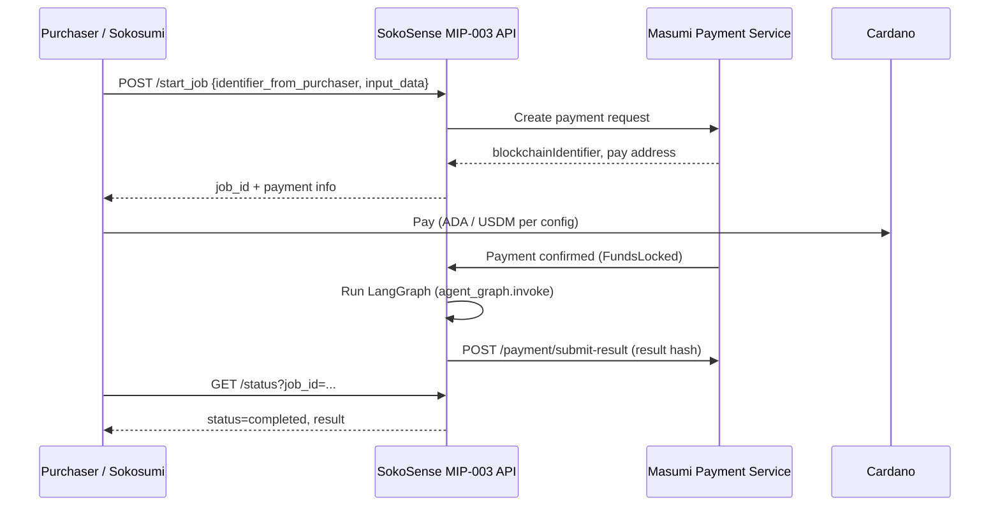

# Masumi Integration Guide for SokoSense

This document explains what **Masumi** is, how it relates to SokoSense today, and how to **deploy the SokoSense agent on the Masumi network**. It is written for judges and implementers. Claims about Masumi are based on [official Masumi documentation](https://docs.masumi.network/documentation); claims about SokoSense are based on this repository.

---

## 1. What is Masumi?

**Masumi** is a decentralized protocol on **Cardano** for **AI agent payments and identity**. It lets agents:

- Register with a verifiable on-chain identity
- Charge for jobs via blockchain micropayments (human-to-agent and agent-to-agent)
- Expose a **standard HTTP API** so marketplaces and other agents can discover and hire them

Masumi is **framework-agnostic** — it works with LangGraph, CrewAI, LangChain, AutoGen, and custom FastAPI services.

### The Masumi ecosystem (three layers)

| Component | Role |
|-----------|------|
| **Masumi Node** (Payment Service + optional Registry) | Wallet management, payment requests, transaction batching, admin UI. You run this (or use hosted registry) to join the network. |
| **Kodosumi** | Production runtime (Ray Serve) for scaling agents; optional for high traffic. |
| **Sokosumi** | Public **marketplace** where users discover and hire registered agents. |

Official docs describe the flow as: *build agent → deploy (optionally on Kodosumi) → list on Sokosumi → Masumi handles payments*.

**References:**
- [Masumi documentation](https://docs.masumi.network/documentation)
- [Cardano Developer Portal — Masumi](https://developers.cardano.org/docs/build/integrate/ai-agents/masumi/)
- [MIP-003: Agentic Service API Standard](https://docs.masumi.network/mips/_mip-003)

---

## 2. How Masumi agents communicate (MIP-003)

To be hireable on the Masumi network, an **agentic service** must implement **MIP-003** — a fixed set of HTTP endpoints.

### Required endpoints

| Endpoint | Method | Purpose |
|----------|--------|---------|
| `/availability` | `GET` | Health check; service must respond so Masumi shows the agent as online |
| `/input_schema` | `GET` | Describes expected `input_data` for `/start_job` |
| `/start_job` | `POST` | Start a paid (or free) job; returns `job_id` and payment details |
| `/status` | `GET` | Poll job status and result (`?job_id=` or `?jobId=`) |

### Optional endpoints

| Endpoint | Method | Purpose |
|----------|--------|---------|
| `/provide_input` | `POST` | Human-in-the-loop — resume jobs awaiting extra input |
| `/demo` | `GET` | Sample input/output for marketing (e.g. Sokosumi listing) |

### Typical paid job flow



The **`pip-masumi`** Python SDK (`pip install masumi`) implements all MIP-003 routes, payment polling, and result submission automatically when you provide a `process_job` handler.

---

## 3. SokoSense today vs Masumi

### What exists in this repo

| Piece | Status | File(s) |
|-------|--------|---------|
| LangGraph agricultural agent | **Implemented** | `engines/agent/graph.py`, `engines/agent/tools.py` |
| HTTP agent API (non-Masumi) | **Implemented** | `POST /api/agent` in `routes/agent.py` |
| Advisory, market, loan, weather tools | **Implemented** | `engines/agent/tools.py` |
| Mock per-query billing for SACCO demo | **Mock only** | `masumi_hook.py`, `data/masumi_hook.py` |
| Revenue demo endpoint | **Mock only** | `GET /webhook/revenue` in `routes/webhook.py` |
| MIP-003 compliant Masumi wrapper | **Not implemented** | — |
| Masumi Node / pip-masumi dependency | **Not in requirements.txt** | — |

### Two different “Masumi” ideas in SokoSense

Judges should distinguish:

1. **Agent marketplace deployment (real Masumi)**  
   Wrap the LangGraph agent in MIP-003 so MFIs, Sokosumi users, or other agents can **pay per job** on Cardano.

2. **Mock SACCO billing (hackathon demo)**  
   `charge_query()` generates fake `masumi_<hash>` IDs and logs KSh amounts when a loan SMS is processed. This **does not** call the Masumi Payment Service or Cardano.

```python
# masumi_hook.py — explicitly a mock
"""Simulates Masumi's per-query micropayment settlement.
Real integration: Masumi AI agent charges the requesting MFI/SACCO
automatically when a paid endpoint (loan, credit score) is queried."""
```

Only the loan webhook path calls `charge_query()` today (`routes/webhook.py`).

### Current agent API is not MIP-003

`POST /api/agent` accepts `{"message": "..."}` and returns `AgentResponse`. That is a **custom** contract (`contract.json`), not Masumi-compatible. Deploying to Masumi means exposing **a separate MIP-003 service** (or replacing/augmenting the API with `pip-masumi`).

---

## 4. Recommended approach: wrap SokoSense with `pip-masumi`

This is the path Masumi documents as fastest: [Build an Agent quickstart](https://docs.masumi.network/documentation/how-to-guides/_quickstart) and [pip-masumi on GitHub](https://github.com/masumi-network/pip-masumi).

### Why this fits SokoSense

- SokoSense already has a single entry point: `agent_graph.invoke({"messages": [HumanMessage(content=...)]})`.
- `pip-masumi` adds `/start_job`, `/status`, `/availability`, `/input_schema`, and payment handling without rewriting payment logic.
- LangGraph is listed as a supported pattern; see also [langgraph-masumi-quickstart-template](https://github.com/masumi-network/langgraph-masumi-quickstart-template) (manual MIP-003 + Masumi `Payment` class).

### Step 1 — Install Masumi SDK

```bash
source .venv/bin/activate
pip install masumi
```

Add `masumi` to `requirements.txt` when you merge this integration.

### Step 2 — Create a Masumi entrypoint

Add a new file (suggested: `masumi_agent.py` at repo root) that wraps the existing graph:

```python
#!/usr/bin/env python3
"""SokoSense agent exposed as a Masumi MIP-003 agentic service."""

import json
import os

from dotenv import load_dotenv
from langchain_core.messages import HumanMessage
from masumi import run

from engines.agent import agent_graph

load_dotenv()

INPUT_SCHEMA = {
    "input_data": [
        {
            "id": "message",
            "type": "string",
            "name": "Farmer question",
            "data": {
                "description": "Natural language question about crops, prices, loans, or weather in Kenya",
                "placeholder": "What are maize prices in Nakuru?",
            },
        }
    ]
}


async def process_job(identifier_from_purchaser: str, input_data: dict) -> str:
    """Run SokoSense LangGraph agent after Masumi payment (or immediately for free agents)."""
    message = (input_data.get("message") or "").strip()
    if not message:
        return json.dumps({"error": "message is required"})

    result = agent_graph.invoke({"messages": [HumanMessage(content=message)]})
    final = result["messages"][-1]
    content = final.content if hasattr(final, "content") else str(final)

    # pip-masumi expects a string return value
    return content


if __name__ == "__main__":
    run(
        start_job_handler=process_job,
        input_schema_handler=INPUT_SCHEMA,
    )
```

**Notes:**
- Keep `FEATHERLSS_API_KEY` and other SokoSense `.env` vars — the agent still needs them inside `agent_graph`.
- `process_job` must return a **string** (SDK wraps it in MIP-003 response shape).
- For local testing without payments: `masumi run masumi_agent.py --standalone --input '{"message": "maize prices in Nakuru"}'`

### Step 3 — Environment variables for Masumi

Add to `.env` (in addition to existing SokoSense keys):

```env
# Masumi agent deployment
AGENT_IDENTIFIER=          # From Masumi admin after registration
PAYMENT_API_KEY=           # From Payment Service admin (required for paid agents)
SELLER_VKEY=               # Selling wallet verification key (paid agents)
PAYMENT_SERVICE_URL=       # e.g. http://localhost:3001 or your hosted node
NETWORK=Preprod            # Preprod for testing, Mainnet for production
PORT=8080                  # Masumi default for masumi run
```

| Variable | Required when | Source |
|----------|---------------|--------|
| `PAYMENT_API_KEY` | Paid agent | Masumi Payment Service admin → API keys |
| `SELLER_VKEY` | Paid agent | `GET /payment-source/` → Selling Wallet `walletVkey` (Preprod/Mainnet) |
| `AGENT_IDENTIFIER` | After registration | Admin UI or `GET /registry/` |
| `PAYMENT_SERVICE_URL` | Optional | Defaults in SDK; set for self-hosted node |
| `NETWORK` | Optional | `Preprod` (test) or `Mainnet` |

**Free agents (Sokosumi demo):** Register the agent as **free** in the registry and list with price 0 on Sokosumi. The SDK skips payment and runs `process_job` immediately; `PAYMENT_API_KEY` / `SELLER_VKEY` are not required. See [pip-masumi README — Free Agents](https://github.com/masumi-network/pip-masumi).

### Step 4 — Validate locally

```bash
masumi check --verbose
masumi run masumi_agent.py
# Open http://localhost:8080/docs
curl http://localhost:8080/availability
curl http://localhost:8080/input_schema
```

---

## 5. Deploy Masumi Node (payment infrastructure)

Before production paid jobs, run a **Masumi Payment Service** (agents and node should be on **separate** hosts per [Hosting Guide](https://docs.masumi.network/documentation/how-to-guides/hosting-guide)).

### Quick local setup (Docker Compose)

From [Installation guide](https://docs.masumi.network/documentation/get-started/installation):

1. Clone Masumi Payment Service repo (official docs).
2. Copy `.env.example` → `.env` (PostgreSQL, Blockfrost API key, admin key ≥15 chars).
3. `docker compose up` (or equivalent).
4. Access:
   - Admin: `http://localhost:3001/admin`
   - OpenAPI: `http://localhost:3001/docs`

You can use the **central registry** at `http://registry.masumi.network` to get started without running Registry Service yourself.

### Hosting architecture (production)

```
┌─────────────────────────┐     ┌──────────────────────────────┐
│  Masumi Node            │     │  SokoSense Masumi Agent      │
│  Payment Service + DB   │◄───►│  masumi run masumi_agent.py  │
│  (VPS / Railway)        │ API │  (separate VPS / Railway)    │
└─────────────────────────┘     └──────────────────────────────┘
              │
              ▼
        Cardano (Preprod / Mainnet)
```

Do **not** run the Payment Service and the agent on the same small VM if you can avoid it — Masumi docs cite resource contention and reliability issues.

---

## 6. Register the SokoSense agent on Masumi

After the MIP-003 API is reachable (public HTTPS URL, not `localhost`):

### Paid agent registration (summary)

1. **Payment source** — `GET /payment-source/` → copy Selling Wallet `walletVkey` for your network (`PREPROD` or `MAINNET`).
2. **Register** — `POST /registry` with agent metadata and **public URL** of your service (e.g. `https://sokosense-agent.example.com`).
3. **Wait** — Registration propagates (minutes); track in admin dashboard.
4. **Agent ID** — `GET /registry/` → copy `agentIdentifier` into `AGENT_IDENTIFIER`.
5. **API key** — Create via admin / `GET /api-key/` → `PAYMENT_API_KEY`.

Detailed steps match [crewai-masumi-quickstart-template § Register](https://github.com/masumi-network/crewai-masumi-quickstart-template) and Masumi API reference.

### Sokosumi marketplace listing

Once registered and `/availability` returns success from the public internet:

1. Ensure MIP-003 compliance (SDK or manual).
2. For paid listings: configure settlement token (docs require **USDM** on target network for Sokosumi; set `PAYMENT_UNIT` accordingly).
3. Submit the [Sokosumi listing form](https://docs.masumi.network/documentation/how-to-guides/list-agent-on-sokosumi).

**Sokosumi requirement:** The agent URL in the registry must be **reachable from Sokosumi’s backend** — tunneling (`ngrok`, Cloudflare Tunnel) works for demos; production needs a stable HTTPS host.

---

## 7. Production deployment options for the agent

### Option A — `masumi run` + process manager (simplest)

On a VPS (Ubuntu example):

```bash
git clone <sokosense-repo>
cd SokoSense
python3 -m venv .venv && source .venv/bin/activate
pip install -r requirements.txt masumi
# copy .env with FEATHERLSS + Masumi vars
masumi check

# PM2 example (from Masumi hosting guide)
pm2 start "masumi run masumi_agent.py" --name sokosense-masumi
```

- Bind to `0.0.0.0` if behind reverse proxy (check `masumi` / uvicorn host settings).
- Put **nginx** or **Caddy** in front for TLS.
- Open firewall only to 80/443.

### Option B — Docker

Containerize `masumi_agent.py` with the same `.env` secrets. Run on Railway, Fly.io, DigitalOcean, AWS ECS, etc. **Separate** from Masumi Node container.

### Option C — Kodosumi (scale)

For many concurrent jobs, deploy via [Kodosumi](https://github.com/masumi-network/kodosumi):

- Ray Serve for distributed execution
- Admin panel, timeline, Masumi payment dashboard
- “Expose” YAML config → boot agents to cluster

Use when SMS/USSD volume or Sokosumi traffic exceeds a single `uvicorn` worker. Not required for hackathon demo.

---

## 8. Mapping SokoSense features to Masumi jobs

One Masumi job = one `process_job` invocation. Inside that, the LangGraph agent may call multiple tools:

| User question (examples) | Internal tools (no extra Masumi charge) |
|--------------------------|----------------------------------------|
| “Maize prices in Nakuru” | `scrape_kamis_prices`, `advise_on_best_market` |
| “Should I sell beans in Meru?” | `advise_on_sell_timing` |
| “Is 5% monthly loan fair?” | `advise_on_loan` |
| “What causes maize rust?” | `answer_farmer_question` → Neo4j RAG + Featherless |
| “Weather in Kisumu” | `get_farmer_weather` |

**Pricing model choices:**

- **Per job** — one Masumi payment per `/start_job` (simplest; matches SDK defaults).
- **Per tool / per SMS** — would require custom metering inside `process_job` or separate registered agents per engine (not implemented today).

Mock `QUERY_PRICING` in `masumi_hook.py` (KSh 5–25 per query type) is a **business model sketch** for SACCO partners, not Cardano pricing. Real Masumi prices are set in lovelace/USDM when creating payment requests.

---

## 9. Migrating from mock `masumi_hook` to real Masumi

| Today (mock) | Target (real Masumi) |
|--------------|----------------------|
| `charge_query()` after loan SMS | Either include loan in paid `/start_job`, or register a dedicated “loan risk” agent |
| `GET /webhook/revenue` in-memory log | Masumi admin dashboard + on-chain explorer |
| Fake `masumi_<hash>` payment IDs | Real `blockchainIdentifier` from Payment Service |

The SMS webhook (`POST /webhook/sms`) can remain on the main FastAPI app for Africa’s Talking. For paid SACCO API access, options include:

1. **Proxy pattern** — SACCO backend calls your MIP-003 `/start_job` instead of raw `/api/loan`.
2. **Dual deployment** — keep free SMS tier on `main.py`; paid B2B on `masumi_agent.py`.
3. **Free agent** — register as free for AgriFin demo; monetize later on Sokosumi.

---

## 10. Checklist for judges / implementers

### Minimum demo (free agent on Preprod)

- [ ] `pip install masumi`
- [ ] Add `masumi_agent.py` wrapping `agent_graph`
- [ ] `masumi check` passes
- [ ] `masumi run` — `/availability` and `/input_schema` work locally
- [ ] Deploy agent to public HTTPS URL
- [ ] Register on Masumi (Preprod), set `AGENT_IDENTIFIER`
- [ ] `/start_job` + `/status` complete a test job
- [ ] (Optional) Submit Sokosumi listing as free agent

### Production paid agent

- [ ] Masumi Payment Service hosted (separate from agent)
- [ ] `PAYMENT_API_KEY`, `SELLER_VKEY`, `NETWORK` configured
- [ ] Wallet funded (ADA / USDM per listing requirements)
- [ ] Agent registered as paid; payment flow tested on Preprod
- [ ] Replace in-memory job store with DB if using manual MIP-003 template (SDK handles storage for basic cases; verify for your scale)
- [ ] Mainnet cutover only after Preprod validation

---

## 11. Troubleshooting

| Symptom | Likely cause |
|---------|----------------|
| Agent works locally but fails on Sokosumi | URL in registry is `localhost` or blocked; fix public HTTPS URL |
| `/start_job` succeeds but job never runs | Payment not completed on chain; check `payment_status` via `/status` |
| `AGENT_IDENTIFIER` errors | Agent not registered or wrong network (Preprod vs Mainnet) |
| `FEATHERLSS_API_KEY` errors inside `process_job` | SokoSense `.env` not loaded on agent server |
| Free agent works in Swagger, fails in Sokosumi | Agent not marked free in registry; see pip-masumi “Free agent” notes |
| Port conflict with SokoSense dev | Masumi defaults to **8080**; SokoSense uses **8000** (API) and **8081** (Vite) — use different `PORT` for Masumi agent |

Run `masumi check --verbose` first for environment diagnostics.

---

## 12. Official references

| Resource | URL |
|----------|-----|
| Masumi docs | https://docs.masumi.network/documentation |
| MIP-003 standard | https://docs.masumi.network/mips/_mip-003 |
| Build an Agent (quickstart) | https://docs.masumi.network/documentation/how-to-guides/_quickstart |
| Install Masumi Node | https://docs.masumi.network/documentation/get-started/installation |
| Hosting guide | https://docs.masumi.network/documentation/how-to-guides/hosting-guide |
| List on Sokosumi | https://docs.masumi.network/documentation/how-to-guides/list-agent-on-sokosumi |
| pip-masumi (Python SDK) | https://github.com/masumi-network/pip-masumi |
| pip-masumi examples | https://github.com/masumi-network/pip-masumi-examples |
| LangGraph + Masumi template | https://github.com/masumi-network/langgraph-masumi-quickstart-template |
| Kodosumi runtime | https://github.com/masumi-network/kodosumi |

---

## 13. Summary

- **Masumi** provides Cardano payments + MIP-003 APIs so agents can be hired on **Sokosumi** or by other services.
- **SokoSense** has a production-ready **LangGraph agent** (`engines/agent/graph.py`) but only a **mock** payment hook today (`masumi_hook.py`).
- **To deploy on Masumi:** wrap `agent_graph.invoke` in `pip-masumi`’s `process_job`, run `masumi run`, host the service publicly, register on the Payment Service, then list on Sokosumi.
- **Keep** the existing `POST /api/agent` and SMS webhook for the demo UI and Africa’s Talking; the Masumi service can run as a **sibling deployment** on another port/host.

The next implementation step in this repo is adding `masumi_agent.py`, `masumi` in `requirements.txt`, and Masumi variables in `.env.example` — the wrapper code in Section 4 is ready to copy.
