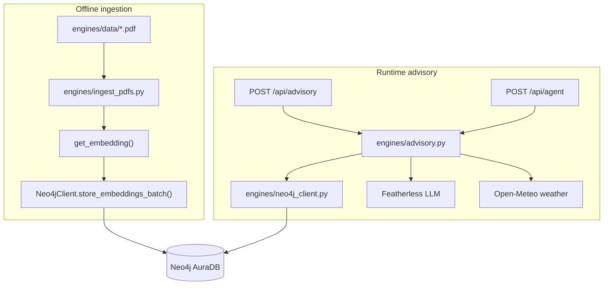

# Neo4j Integration in SokoSense

> **Kenya AI Challenge submission:** see [`NEO4J_INTEGRATION_DOCUMENT.md`](./NEO4J_INTEGRATION_DOCUMENT.md) for the judge-facing 1–2 page document aligned with the official Neo4j template. This file is the technical deep-dive.

This document explains how **Neo4j AuraDB** is used in SokoSense for the Kenya AI Challenge / AgriFin track. Everything below is based on the current codebase — no aspirational features.

---

## 1. Role in the product

SokoSense helps Kenyan smallholder farmers make decisions via SMS, USSD, and a web UI. Neo4j powers the **agricultural advisory (RAG) pipeline**: structured crop–disease knowledge plus semantic search over ingested PDF guides.

Neo4j is **not** used by the market, timing, or loan engines in the live FastAPI path. Those engines use live KAMIS price data (`engines/kamis_tool.py`) with mock fallbacks.

| Feature | Neo4j used? | Primary file(s) |
|---------|-------------|-----------------|
| Advisory Q&A (`POST /api/advisory`) | Yes | `engines/advisory.py`, `engines/neo4j_client.py` |
| Agent farming questions (`POST /api/agent` → `answer_farmer_question` tool) | Yes (via advisory) | `engines/agent/tools.py` |
| PDF knowledge ingestion | Yes | `engines/ingest_pdfs.py` |
| Market / timing / loan decisions | No | `engines/market.py`, `engines/timing.py`, `engines/loaning.py` |

---

## 2. Architecture overview



**Two retrieval paths at query time:**

1. **Structured graph query** — crop/disease relationships (symptoms, remedies, best practices).
2. **Vector search** — nearest-neighbour search over PDF text chunks stored as `DocumentChunk` nodes.

Both contexts are passed to the Featherless LLM, which writes the final farmer-facing answer.

---

## 3. Graph schema (advisory knowledge)

Defined and used in `engines/neo4j_client.py`.

### Node labels

| Label | Purpose |
|-------|---------|
| `Crop` | e.g. Maize, Beans, Tomatoes, Potatoes |
| `Disease` | e.g. Maize Rust, Late Blight, Fall Armyworm |
| `Symptom` | Observable signs of a disease |
| `Remedy` | Treatment or control measures |
| `BestPractice` | Agronomic practices for a crop |
| `Location` | Kenyan locations (schema supports `(Location)-[:GROWS]->(Crop)`) |
| `DocumentChunk` | Text chunk from an ingested PDF + embedding vector |

### Relationships

```
(Crop)-[:AFFECTED_BY]->(Disease)
(Disease)-[:HAS_SYMPTOM]->(Symptom)
(Disease)-[:TREATED_BY]->(Remedy)
(Crop)-[:HAS_PRACTICE]->(BestPractice)
(Location)-[:GROWS]->(Crop)
```

### Seed data

`Neo4jClient.ingest_seed_data()` runs Cypher from `_SEED_CYPHER` — Kenyan crop/disease facts for maize, beans, tomatoes, and potatoes (14 disease entries with symptoms, remedies, and practices).

If Neo4j is unreachable, `query_knowledge_graph()` falls back to the same content via `_sample_data()` in Python so the API still returns useful answers.

---

## 4. Vector store (PDF RAG)

### Ingestion pipeline

Script: `engines/ingest_pdfs.py`

1. Read PDFs from `engines/data/` (currently `maize.pdf`, `tomato.pdf`).
2. Extract text per page with `pypdf`.
3. Chunk text (~500 characters, 100-character overlap, sentence-aware).
4. Generate an embedding per chunk via `get_embedding()` in `neo4j_client.py`.
5. Store as `DocumentChunk` nodes with metadata: `pdf_name`, `page_num`, `chunk_idx`, `text`, `embedding`.

Run:

```bash
python engines/ingest_pdfs.py              # all PDFs
python engines/ingest_pdfs.py --file maize.pdf
python engines/ingest_pdfs.py --dry-run      # preview chunks only
```

On a full run, existing `DocumentChunk` nodes are cleared first to avoid duplicates.

### Vector index

On connect, `Neo4jClient._ensure_vector_index()` creates (if missing):

- Index name: `document_chunks`
- Type: Neo4j 5.x vector index on `DocumentChunk.embedding`
- Dimensions: **1536**
- Similarity: **cosine**

### Query

`vector_search(query_text, top_k=5)` embeds the farmer's question, then runs:

```cypher
CALL db.index.vector.queryNodes($index_name, $top_k, $embedding)
YIELD node, score
RETURN node.text, node.pdf_name, node.page_num, node.chunk_idx, score
```

Top chunks are formatted into the LLM prompt with source PDF name and page number.

---

## 5. Runtime advisory flow

Entry point: `answer_farmer_question()` in `engines/advisory.py`  
HTTP route: `POST /api/advisory` in `routes/advisory.py`

| Step | What happens |
|------|----------------|
| 1 | Keyword extraction (no LLM) — crop, disease, location from lists of Kenyan crops/locations/disease terms |
| 2a | `query_knowledge_graph(crop, disease)` — structured Cypher query |
| 2b | `vector_search(query, top_k=5)` — semantic PDF retrieval |
| 3 | If location found → Open-Meteo weather + farming advice |
| 4 | Build prompt with graph context, vector context, and weather |
| 5 | Featherless LLM generates JSON answer (`response`, `type: advisory`) |

Response includes `sources` (knowledge-base rows, PDF references, weather attribution).

---

## 6. Agent integration

The LangGraph agent (`engines/agent/graph.py`) exposes tool `answer_farmer_question` in `engines/agent/tools.py`, which calls the same advisory pipeline. When a user asks a crop/disease question via `POST /api/agent`, the agent can invoke this tool and return Neo4j-backed advice inside JSON for SMS/USSD gateways.

---

## 7. Configuration

From `.env.example` (code reads `NEO4J_USER`, not `NEO4J_USERNAME`):

```env
NEO4J_URI=neo4j+s://<instance-id>.databases.neo4j.io
NEO4J_USER=neo4j
NEO4J_PASSWORD=<password>
```

- Driver: official `neo4j` Python package (`requirements.txt`: `neo4j>=5.0.0`).
- Connection: `GraphDatabase.driver()` with `neo4j+s://` (TLS) for Aura.
- Client: `engines/neo4j_client.py` — `Neo4jClient` class.

---

## 8. Graceful degradation

The system is designed to keep responding when Neo4j is down or misconfigured:

| Condition | Behaviour |
|-----------|-----------|
| `NEO4J_URI` or `NEO4J_PASSWORD` missing | `_enabled = False`; graph uses `_sample_data()`; vector search returns `[]` |
| Connection / DNS failure | Logged error; same fallbacks as above |
| Query / vector search error | Logged; empty vector results or sample graph data |
| Advisory still returns HTTP 200 | LLM answers using sample data + its training; fewer grounded sources |

---

## 9. Supplementary market graph (not wired to live engines)

The repo also contains a **separate** market-price graph in `neo4j_graph.py` and `data_pipeline.py`:

```
(Market)-[:HAS_PRICE]->(PricePoint)-[:FOR_CROP]->(Crop)
(Market)-[:NEAR_TO]->(Market)
```

`neo4j_graph.py` can seed 7 markets, 6 crops, and mock price/trend data via `load_all()`.

**Important:** `engines/market.py` and `engines/timing.py` do **not** import `data_pipeline.py` today. They use `data.price_pipeline.get_live_prices()` (KAMIS). The market Neo4j module is present for the data layer but is not on the live decision path unless separately integrated.

---

## 10. Key files (quick reference)

| File | Responsibility |
|------|----------------|
| `engines/neo4j_client.py` | Aura connection, graph queries, vector index, embeddings, seed Cypher |
| `engines/advisory.py` | RAG orchestration consuming Neo4j + weather + LLM |
| `engines/ingest_pdfs.py` | PDF → chunks → Neo4j |
| `engines/data/*.pdf` | Source documents |
| `routes/advisory.py` | `POST /api/advisory` |
| `engines/agent/tools.py` | Agent tool wrapping advisory |
| `neo4j_graph.py` | Market price graph (standalone loader) |
| `data_pipeline.py` | `get_trend()` / `get_best_market()` over market graph (not used by timing/market engines yet) |

---

## 11. How judges can verify

1. Set valid `NEO4J_URI`, `NEO4J_USER`, `NEO4J_PASSWORD` in `.env`.
2. Seed graph (optional): call `Neo4jClient().ingest_seed_data()` from a Python shell.
3. Ingest PDFs: `python engines/ingest_pdfs.py`
4. Start app: `./scripts/dev.sh`
5. Test advisory: `POST /api/advisory` with body `{"query": "What causes maize rust in Nakuru?"}`
6. Check response `sources` for knowledge-base and PDF references when Neo4j is connected.

---

## 12. Known limitations (honest)

- **Embeddings:** `get_embedding()` has Featherless embeddings **disabled** in code (`if False:`) because the Featherless embeddings endpoint returned 404. Chunks use a deterministic hash-based fallback vector (1536 dims) for development — not true semantic embeddings until a working embedding API is configured.
- **Aura instance must be live:** An invalid or deleted Aura hostname causes DNS errors; the app falls back to sample data.
- **Keyword extraction** for crop/disease/location is rule-based, not LLM-based — unusual phrasing may miss entities.
- **Market Neo4j graph** exists in the repo but is not connected to the market/timing FastAPI engines in the current code.
