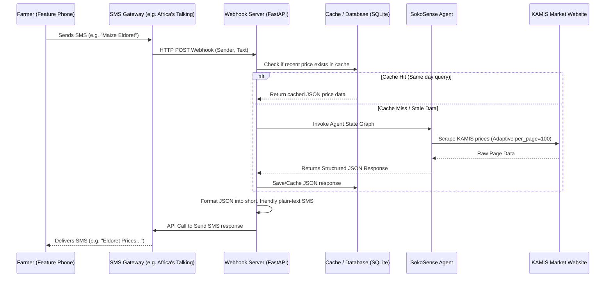

# SokoSense: SMS Integration Plan for Feature Phones

This document outlines the architecture, data flow, and implementation details to enable farmers using basic feature (non-smart) phones to query SokoSense market prices via SMS.

---

## 1. High-Level Architecture



---

## 2. Key Technology Stack

| Component | Technology | Rationale |
|---|---|---|
| **SMS Gateway Provider** | **Africa's Talking (AT)** | The leading telco API platform in East Africa. Standard sandbox for testing, low-cost shortcodes, and reliable bulk/two-way SMS. |
| **Web Server / Webhook** | **FastAPI** (Python) | Extremely fast asynchronous execution; handles high concurrent incoming SMS webhooks with low latency. |
| **Local Tunnel (Dev)** | **Ngrok** | Exposes the local dev webhook to the internet so the Africa's Talking API can deliver SMS payloads. |
| **Database & Cache** | **SQLite** or **Redis** | Stores session state, rate limit records, and caches scraped price datasets for up to 24 hours to minimize Groq token costs. |

---

## 3. SMS Message Constraints & Formatting

Standard SMS messages are billed per **160-character segment**. If the agent's response is too long, it will be split into multiple SMS messages, which increases costs and is hard to read on older phones.

### The SMS Formatter Module
We must translate the SokoSense agent's structured JSON output into a ultra-compact plain text format.

#### JSON Output (from SokoSense Agent):
```json
{
  "location": "Nairobi",
  "date": "2026-06-15",
  "prices": [
    {
      "commodity": "Dry Maize",
      "market": "Kawangware",
      "wholesale": "55.00/Kg",
      "retail": "65.00/Kg"
    },
    {
      "commodity": "Maize Flour",
      "market": "Nairobi Supermarkets",
      "wholesale": "-",
      "retail": "79.50/Kg"
    }
  ]
}
```

#### Compact SMS Output (Formatted):
```text
SokoSense Nairobi 15-Jun:
- Dry Maize (Kawangware): Whls KES 55, Rtl KES 65
- Maize Flour (Supermkts): Rtl KES 79.5
Call 0800-XXX for help.
```
*(Total: 147 characters — fits in a single 160-char SMS).*

---

## 4. Query Parsing & User Experience (UX)

Because SMS queries are typed manually, farmers will use various formats. The webhook controller must clean and standardize these inputs before invoking the agent:

1. **Standard queries**: `"Maize Kakamega"` or `"Tomato Nairobi"`
2. **Keyword matching**: If a user enters only a city (e.g., `"Nakuru"`), the webhook prompts:
   > *"Which crop's price do you want to see in Nakuru? Reply with 'Crop Nakuru' (e.g., Maize Nakuru)."*
3. **Typo mitigation**: Use basic string matching or lightweight text distance libraries (like `Levenshtein`) to map misspelled cities or crops (e.g., `"mzize"` -> `"maize"`, `"nairbi"` -> `"nairobi"`) before passing them to SokoSense.

---

## 5. Phased Implementation Plan

### Phase 1: Gateway Setup
1. Sign up on [Africa's Talking](https://africastalking.com/).
2. Set up an SMS Shortcode/Incoming Number in the Sandbox dashboard.
3. Configure the incoming SMS callback URL (e.g., `https://your-domain.com/incoming-sms`).

### Phase 2: Webhook Development
1. Create a `webhook.py` using FastAPI.
2. Define a POST endpoint `/incoming-sms` to accept the form-urlencoded payload from Africa's Talking (`from`, `to`, `text`, `date`).
3. Add a validation step to ensure requests originate from Africa's Talking.

### Phase 3: SokoSense Agent Integration
1. Import `agent_graph` into the webhook module.
2. Pass the incoming SMS text to the SokoSense state graph.
3. Add a dedicated parser/helper function to extract the resulting JSON block and convert it to plain text.

### Phase 4: Local testing
1. Start the local server.
2. Launch Ngrok (`ngrok http 8000`) and map the public URL in the Africa's Talking developer console.
3. Use the Africa's Talking Sandbox simulator to type message queries and verify incoming/outgoing responses.

### Phase 5: Production Deployment
1. Deploy to a hosting service (e.g., Render, AWS EC2, or Railway).
2. Set up SSL certificates (HTTPS is mandatory for webhooks).
3. Connect live shortcodes (e.g., purchasing a premium rate or toll-free SMS number from Safaricom/Airtel through the gateway provider).

---

## 6. Optimization & Safeguards

- **Aggressive Caching**: Cache all scrapes by `(crop, location)` for 12 hours. If another farmer queries the exact same crop/location, serve it directly from SQLite without invoking the agent or hitting the KAMIS website.
- **SMS Rate Limiting**: Limit individual phone numbers to 5 SMS requests per hour to prevent abuse or loop charges.
- **Character Slicing**: Ensure the formatter cuts off the text at 320 characters (maximum 2 SMS segments) to control telco billing costs.
