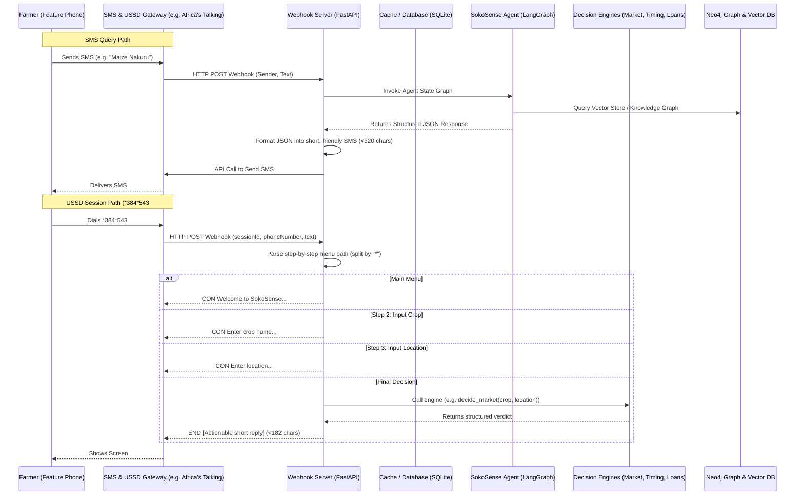

# SokoSense: SMS & USSD Integration Plan for Feature Phones

This document outlines the architecture, data flow, and implementation details to enable Kenyan farmers using basic feature (non-smart) phones to query SokoSense market prices, timing decisions, loan verifications, and crop advisory RAG tools via SMS and USSD.

---

## 1. High-Level Architecture



---

## 2. Key Technology Stack

| Component | Technology | Rationale |
|---|---|---|
| **SMS/USSD Gateway** | **Africa's Talking (AT)** | Industry-standard telco API platform in East Africa. Standard sandbox for testing, low-cost shortcodes, and reliable bulk/two-way SMS and USSD gateways. |
| **Web Server / Webhook** | **FastAPI** (Python) | High concurrent execution; handles rapid USSD session timeouts (<3 seconds) and incoming webhooks with low latency. |
| **Database & Cache** | **SQLite** | Stores session states, rate limit records, and caches scraped price datasets for up to 12 hours. |
| **Decision Engines** | **SokoSense Modules** | Local engines (market, timing, loans) and Neo4j RAG pipeline. |

---

## 3. SMS Integration Pipeline

Farmers can query SokoSense by sending natural language or key-value SMS messages. 

### Webhook Controller Logic
1. **Endpoint**: `POST /webhook/sms`
2. **Payload**: Receives `from` (sender phone number) and `text` (body of SMS) in URL-encoded form data.
3. **Execution**: Passes the raw query directly to the LangGraph `agent_graph` which automatically extracts intent and invokes the correct tool (`scrape_kamis_prices`, `answer_farmer_question`, `advise_on_loan`, `advise_on_sell_timing`, etc.).
4. **Formatting**: Translates the agent's structured JSON output into a compact, text-only SMS.

### Message Constraints & SMS Formatter
* Standard SMS messages are billed per **160-character segment**. 
* Responses are hard-capped at **320 characters** (2 segments) to control telco costs.

#### SMS Output Formatting Rules
* **Market/Prices**: `SokoSense [Crop] in [Location]: [Min-Max] KES/Kg (Date: [Date]).`
* **Timing**: `SokoSense Timing: [Recommendation] (Trend: [RISING/FALLING] by KSh [Diff]/bag). [Advice]`
* **Loan**: `SokoSense Loan: [Risk Verdict] ([APR]% APR vs CBK Benchmark). [Summary advice]`
* **Advisory**: `SokoSense Advisory: [Remedy/Control].`

---

## 4. USSD Integration Pipeline (*384*543#)

For offline farmers or those without airtime, USSD provides a menu-driven interface.

### Session State Parsing
USSD is stateless. Africa's Talking sends the entire input string accumulated during the session, separated by asterisks (`*`):
* `text=""`: The farmer just dialed the code. Show the Main Menu.
* `text="1"`: Option 1 selected. Show the crop input prompt.
* `text="1*maize"`: Option 1 selected, crop is "maize". Show the location prompt.
* `text="1*maize*nakuru"`: Option 1, crop is "maize", location is "nakuru". Execute decision and return final response.

### USSD Formatting Constraints
* USSD screens must fit within **182 characters**.
* Responses must start with:
  * `CON ` (Continue): Keeps the session open to ask for another input.
  * `END ` (End): Shows the final text and closes the session.

---

## 5. Farmer Interaction & Simulation Traces

### USSD Session Simulations

#### 1. Crop Price & Best Market Search (Option 1)
```text
Farmer Dials: *384*543#
Screen 1 (CON):
  Welcome to SokoSense
  1. Market Decision
  2. Sell Timing
  3. Loan Verdict
  4. Crop Advisory

Farmer Enters: 1
Screen 2 (CON):
  Enter crop name (e.g. maize, tomatoes):

Farmer Enters: tomatoes
Screen 3 (CON):
  Enter location for tomatoes (e.g. Nakuru, Meru):

Farmer Enters: Meru
Screen 4 (END):
  SELL IN MUMIAS. KSh 3,465 more per bag. Worth the trip.
```

#### 2. Sell Timing Advice (Option 2)
```text
Farmer Dials: *384*543# -> Selects Option 2 -> Enters "maize" -> Enters "Nakuru"
Screen 4 (END):
  HOLD/BUY. Trend: RISING. Sellers: HOLD (prices are up KSh 1,750/bag). Buyers: BUY today before prices rise further.
```

#### 3. Loan Risk Assessment (Option 3)
```text
Farmer Dials: *384*543# -> Selects Option 3
Screen 2 (CON):
  Enter monthly interest rate % (e.g. 1.5):

Farmer Enters: 1.5
Screen 3 (END):
  CAUTION. 19.56% APR. Above CBK benchmark. Compare SACCO options first.
```

#### 4. Crop Advisory RAG Pipeline (Option 4)
```text
Farmer Dials: *384*543# -> Selects Option 4
Screen 2 (CON):
  Describe your crop issue/question:

Farmer Enters: Maize leaves with orange spots in Meru
Screen 3 (END):
  Advisory: Maize rust (Puccinia sorghi) is likely. Use resistant varieties, plant early, apply Mancozeb fungicide, and rotate crops.
```

---

## 6. Optimization & Safeguards

* **Aggressive Caching**: Cache all scrapes and database answers by `(crop, location)` for 12 hours to minimize third-party API and LLM token costs.
* **SMS Rate Limiting**: Limit individual phone numbers to 5 SMS requests per hour using `agent_query_limiter`.
* **Fallback Mode**: If Neo4j or LLM APIs fail, the webhook automatically routes requests to mock data templates, ensuring the farmer always receives a response.
